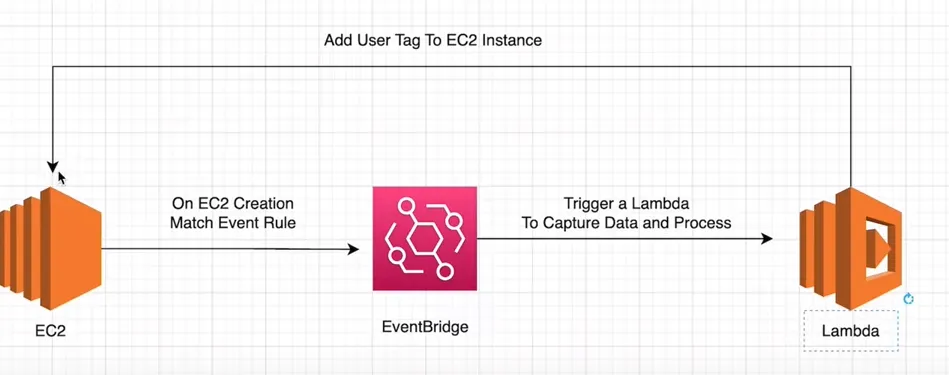

## Assigning an "Owner" Tag to an EC2 Instance

### AWS Tools

- Lambda
- CloudWatch
- CloudTrail
- Amazon EventBridge
- EC2
- IAM → Roles & Policies

### Guide 

1. **Create a Lambda Function**
    1. Set a Tag → Runtime: Choose Python (Or other) → Create Function
    2. Create a Blank Test Event to test code
        1. Set a Tag → errase keys and values of the json file → Save
    3. **Create a CloudTrail**
    4. Create an event breach rule
        1. Event is triggered when the EC2 instance is created
        2. Rules → Create Rule → Set a Name → Set AWS Service → Set Event Type: AWS API call via CloudTrail
            - If you want a rule for whenever an instance starts and stops, you can use EC2 instance state-change notification instead of AWS API call via CloudTrail
        3. Select Specific Operation(s) → RunInstances
        - why RunInstances: If you go to CloudTrail → Event history → RunInstances is created when an EC2 instance is created. You use the event history to trigger an alarm
    5. Select a Target → Lambda function → Select you Function you created → Create Rule
    6.  Write a Python Code within lambda to tag the ec2 instance to whoever created it
        1. Search in the web boto3 → Amazon EC2 Code Examples → Managing Amazon EC2 instances → Start and stop instances →
            - [Managing Amazon EC2 instances - Boto3 1.36.21 documentation](https://boto3.amazonaws.com/v1/documentation/api/latest/guide/ec2-example-managing-instances.html)
            - [create_tags](https://boto3.amazonaws.com/v1/documentation/api/latest/reference/services/ec2/client/create_tags.html)
    7. Modify Permissions of Lambda Function
        1. Configuration → Permissions → Policy Name → **Permissions defined in this policy: click in JSON → Edit → Add Actions: EC2 → Create Tags**
        2. Add Resource → EC2 ; Resource Type → All Resources
    8. Create a new EC2 Instance → Select Instance →Tags
        1. Now you can see tag with the owner’s name who had created the EC2 instance
