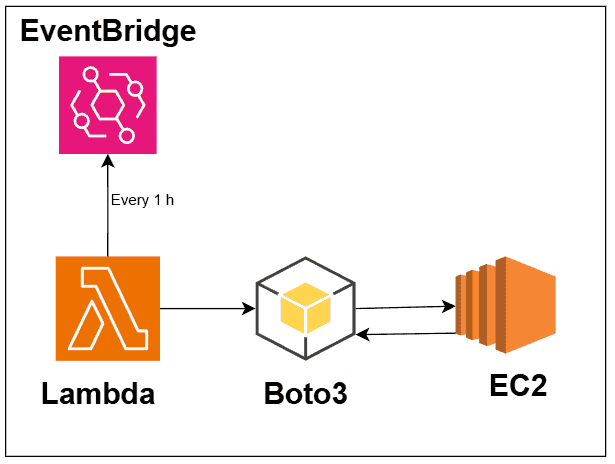
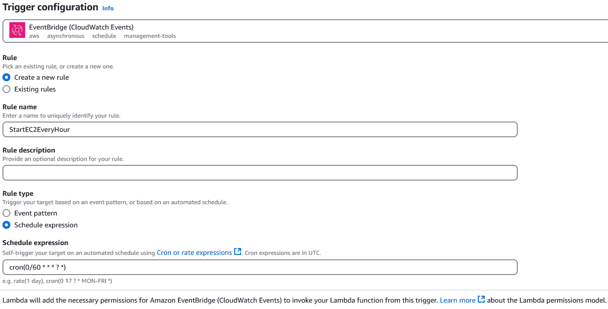

## AWS EC2 Automatization with Boto3 and Lambda

- [Boto3 1.36.21 documentation](https://boto3.amazonaws.com/v1/documentation/api/latest/index.html)
- https://boto3.amazonaws.com/v1/documentation/api/latest/guide/resources.html
- [Collections - Boto3 1.36.21 documentation](https://boto3.amazonaws.com/v1/documentation/api/latest/guide/collections.html)
- https://boto3.amazonaws.com/v1/documentation/api/latest/reference/services/ec2.html
- https://boto3.amazonaws.com/v1/documentation/api/latest/reference/services/ec2/instance/start.html
- Important → [Using cron and rate expressions to schedule rules in Amazon EventBridge - Amazon EventBridge](https://docs.aws.amazon.com/eventbridge/latest/userguide/eb-scheduled-rule-pattern.html)
1. Create a Lambda Function 
2. Alter policy and grant all actions and permissions for sake of time
3. Add a trigger
4. Create a EventBridge and set notification every 1h using **cron**
    
    
    

Monitor and Auto-Restart Stopped EC2 Instances Every Hour

### AWS Tools

- EC2
- Lambda
- Boto3
- Event Bridge
- app.diagrams.net
