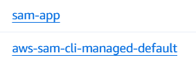
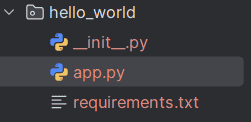
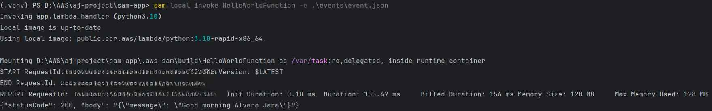

## Developing AWS Lambda Functions Locally in VS Code


**AWS Serverless Application Model (SAM)**: is an open-source framework designed to simplify the process of building serverless applications using infrastructure as code (IaC). 

- AWS SAM allows developers to declare AWS CloudFormation resources and specialized serverless resources using a shorthand syntax
- With few lines you can create the application that you want
- Deploy and update your resources

---

1. Install AWS SAM CLI 
- [Install the AWS SAM CLI - AWS Serverless Application Model](https://docs.aws.amazon.com/serverless-application-model/latest/developerguide/install-sam-cli.html)
- [AWS SAM template anatomy - AWS Serverless Application Model](https://docs.aws.amazon.com/serverless-application-model/latest/developerguide/sam-specification-template-anatomy.html)

```bash
sam --version

// See Commands
sam -h

// Create a sample file 
sam init -> 1 -> 1 -> y -> y -> y -> y -> [enter] 

sam build

sam deploy --guided
```

- Tip: *Every time you make a change be sure to rebuild it, run **sam build** again*

In Cloud Formation you can observe:



- aws-sam-cli-managed-default: creates an s3 bucket to store your artifacts. This is a one-time thing the first time that you use sam
- sam-app is your resource, this is what we are deploying
- Go to lambda → Functions → Check if function was created
- You can manage you lambda function with you app.py



- Event folder will receive each event that occurs when the lambda function is called; you can errase everything and set some values for testing purposes → then after modifications of [app.py](http://app.py) and events.json run the following

```bash
# First Build
sam build
# See Events in terminall
sam local invoke lambdafunction_name -e events/event.json
# Deploy in AWS
sam deploy
```



**Notice**: *If you want to delete your stack, you cannot do it from the SAM CLI*

**Instead**: *You can run the following command with aws or delete it within AWS Console*
```
aws cloudformation delete-stack --stack-name sam-app 
```

2. Download Docker Desktop
3. Authenticate w/ AWS

### Summary

1. Create Function
2. Define Resources
3. Open Lambda Function and Start to Develop. When your are happy with your changes your are gonna build it and deploy it
4. If you need to test it locally, just create an event.json with your event data and evoke locally
5. Test -> Build -> Ready -> Deploy It
6. Delete stack with **aws** command


### AWS Tools

- AWS Serverless Application Model (SAM)
- AWS Cloud Formation
- Docker Desktop
